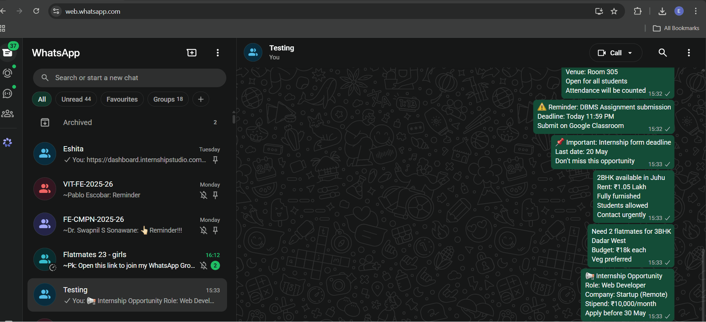
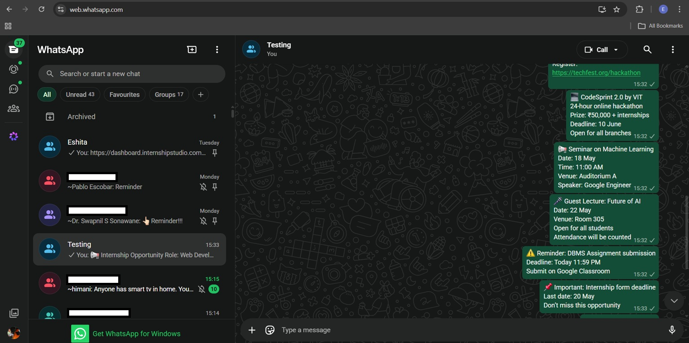
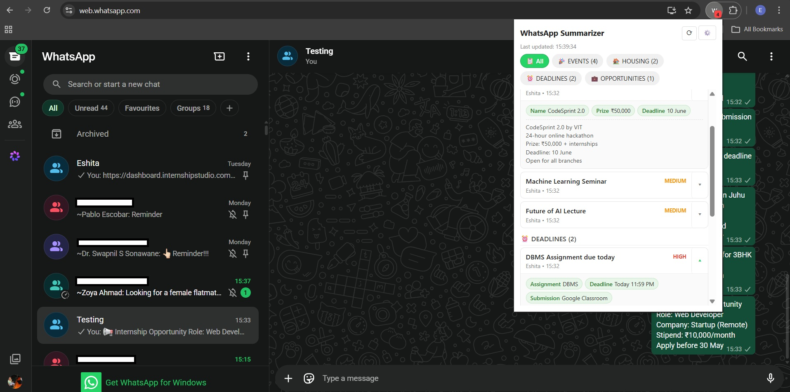

# WhatsApp-Digest 

> “Turn noisy WhatsApp chats into clear, actionable insights.”

[](LICENSE)
[](https://github.com/eshitashah/WhatsApp-Digest)
[](CONTRIBUTING.md)



---

##  Problem

WhatsApp groups are full of important information — but it gets lost in noise.

- Students miss hackathons, deadlines, and events buried in group chats
- Important updates are buried in casual chats  
- Time is wasted scrolling through irrelevant messages  

---

##  Solution

**WhatsApp-Digest** automatically:

- Categorizes messages (Events, Deadlines, Housing, Opportunities)  
- Extracts key details (dates, prices, venues)  
- Highlights important messages  

 So you only see what actually matters.

---

##  Before vs After

### Before (Raw WhatsApp Chat)


### After (AI Categorized View)


---

##  Quick Start

### Installation
1. Clone the repo:
```bash
   git clone https://github.com/eshitashah/WhatsApp-Digest.git
```
2. Open Chrome → `chrome://extensions/` → Enable **Developer mode**
3. Click **Load unpacked** → Select the folder
4. Get a free API key from [Groq](https://console.groq.com/keys) or [Gemini](https://aistudio.google.com/apikey)
5. Click extension icon → Settings → Paste your API key → Save

---

##  Features

-  AI-powered categorization  
-  Smart categories:
   - Events  
   - Deadlines   
   - Opportunities  
-  Key detail extraction  
-  Urgency indicators  
-  Jump to original message  
-  Fast processing  

---

## ⚙️ Tech Stack

- JavaScript  
- Chrome Extension APIs (Manifest V3)  
- DOM Manipulation  
- Groq API (Llama 3.3) / Google Gemini  

---

##  How It Works

1. **Extract** - Reads messages from WhatsApp Web using DOM parsing
2. **Analyze** - Sends to Groq AI (Llama 3.3) for intelligent categorization
3. **Display** - Shows organized results in popup with urgency indicators
4. **Privacy** - No data stored, runs entirely in your browser

---

##  Privacy

- No data stored  
- Runs locally in browser  
- Messages are only sent temporarily to the selected LLM API

## 📜 License
MIT License - see [LICENSE](LICENSE) for details.

---

##  Roadmap

**v1.1 (Next)**
- [ ] Multi-group support (categorize multiple groups at once)
- [ ] Search within summaries
- [ ] Export to PDF/text

**v2.0 (Future)**
- [ ] Mobile app support
- [ ] Custom categories  

---

##  Author

**Eshita Shah**  
B.Tech Computer Science Student  
## 👩‍💻 Author
**Eshita Shah**  
B.Tech Computer Science Student  

[]((https://www.linkedin.com/in/eshita-shah-61b5982b2))
[](https://github.com/eshitashah)
[](eshita1.shah@gmail.com)

---

##  Support

If you found this useful:
- ⭐ Star the repo  
- Share with friends  

---
